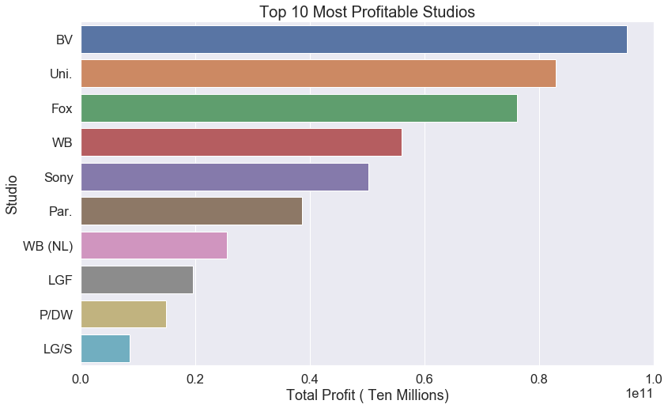
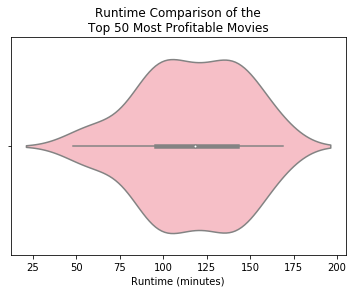
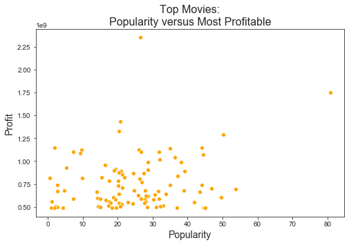
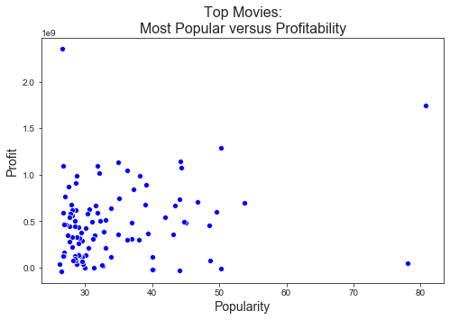
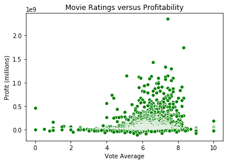
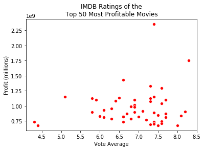
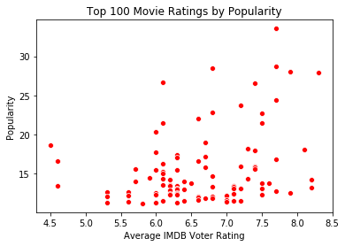

# Module 1 Project: At the Movies with Microsoft

* **Student name:** Shirl Williams
* **Student pace:** Full Time
* **Instructor name:** Rafael Carrasco
* **Blog post URL:** https://shirlwilliams.github.io/

***

## Outline

* Overview and Goals
* Question 1 Discussion
* Question 2 Discussion
* Question 3 Discussion
* Extra Question 4 Discussion
* Extra Question 5 Discussion
* Extra Question 6 Discussion
* Summary
***

Overview and Goals 
&emsp;This project required an assessment of the movie industry through data exploration. 

    
## Goals
The overall goal of this project is to find useful insights while practicing exploratory data analysis. Our premise is to investigate the available data to assist Microsoft as they begin a movie industry. Our analysis should include assessments on what movies were a box office success.
    
Datasets provided for exploration:

* imdb_title_crew.csv
* tmdb_movies.csv
* imdb_title_akas.csv
* imdb_title_ratings.csv
* imdb_name_basics.csv
* imdb_title_basics.csv
* tn_movie_budgets.csc
* bom_movie_gross.tsv

Q1 Are there any patterns or relationships among the most profitable movies? &emsp;Explore genres as they relate to movie profit.

    
## Exploration (EDA)
(Discliamer: This exploration was taken from a class session hosted by our instructor.)
A database was created to include all the files presented in our project. A tabular preview of information available was created and evaluated. A determination was made to compare genres to profit and a dataframe was created for this comparison by taking the world-wide gross and subtacting the production budget. For our investigation we chose to view the top 100 most profitable movies. Upon sorting it was determined the top 5 most profitable movies were *Avatar*, *Titanic*, *Avengers: Infinity War*, *Star Wars Ep. VII: The Force Awakens*, and *Jurassic World*. A list was created of genres from the dataframe and a count was taken of each genre from the list of top profitable movies. A barh graphic was created from this list of most profitable movies (shown below). Notice that Adventrue seems to be the most profitable and the top 5 movies listed above all contain the Adventure genre. The tables created for movie comparison by profit were saved for use in other investigations. 

## Insights/Findings/Recommendations

**Findings**
After examining the top 100 movies for gross/budget difference, I found that the most represented genres were Adventure, Action and Sci-Fi. Of the top 100 movies, 43 movies did not have genre data available and were subsequently deleted. The lowest represented genres were Music and Biography.

**Recommendations**
Movies of the genres Adventure, Action, or Sci-Fi have the most likelihood of drawing a profit. Most Musical and Biography films should be avoided.

**Next Steps**
The data provided contained many gaps. A thorough cleaning of the data is recommended to include attempts to fill in missing data.

Q2 What studios tend to make the most profitable 
movies? &emsp;Explore top movies by production company.

## Exploration (EDA)
Since Microsoft is beginning the movie making business, it might benefit them to see who the top production 
companies might be. The table with production company/studio information was joined to the profit table creating 
a new dataframe to investigate movie studios as they relate to profit. A dataframe with average profit by studio 
was created. A chart representing the top 10 studios was isolated (representative graph below).

## Insights/Findings/Recommendations

**Findings**
The top 3 most profitable studios are Buena Vista, Universal and Fox. 

**Recommendations**
An investigation into what the top three studios are doing would likely be beneficial. It is worth noting that 
some studios might be listed more than once as WB(NL) and WB are likely both versions of Warner Brothers studios 
as well as LGF and LG/S seem to be versions of Lions Gates studios.

**Next Steps**
An investigation and thorough cleaning of studios names may produce different results. I suspect that combining studios (ex: LGF and LG/S) will change the list slightly. May also want to find the average profit/movie to account for sheer volumel
(By the way - if you use average profit instead of total profit you get a studio called Greater India that shows up third.) 

Q3 What is a good length for a movie? &emsp;Explore movie runtime as it relates to profit.

    
## Exploration (EDA)
Tables from the database were explored for possible characteristics of profitable movies. Runtime length was selected for exploration. Tables were chosen incidating movie runtime and the most profitable movies and a new table was created. After adjusting for duplicates and dropping movies where runtime was missing a table of the top 50 most profitable movies was created. Statistics were examinated and a violin plot was created to visually represent the findings (below).

## Insights/Findings/Recommendations

**Findings**
After examining statistical data (5 number summary) of the top 50 most profitable movies and how runtime relates, most of the movies (middle IQR) had runtimes between 95 and 142 minutes. However, 4 of the top 10 had runtimes outside of this range. 

**Recommendations**
Set a target runtime length of movies to be between 95 and 142 minutes.

**Next Steps**
An investigation and thorough cleaning of profit data may produce different results.

Q4 Are more profitable movies also the most popular? &emsp;Explore popularity versus profitability among top movies

    
## Exploration (EDA)
One might think it reasonable that more popular movies would be most profitable, so this investigation set out to verify this generalization. A table with popularity ratings was joined to a table showing movie profitablility. I took the to 100 most profitabile movies and looked at the distribution of their popularity (top graph below). Secondly I took the top 100 most popular movies and created a distribution of their profitability (bottom graph below).

## Insights/Findings/Recommendations

**Findings**
Although there is a slight upward trend, it appears that profitability and popularity are not necissarily tied together. 

**Recommendations**
Care must be taken, as in all things, to maximize profit. The popularity of a movie is not the main determination of profit.

**Next Steps**
An investigation and thorough cleaning of movies by profit and/or popularity may produce different results.

Q5 Do more profitable movies also have higher ratings? &emsp;Higher Rated Movies versus Profit

    
## Exploration (EDA)
An investigation of the IMDB organization and their ratings as it relates to profits might produce an association that worth looking into. Joining tables from the movie database to compare IMDB ratings versus their popularity I created a table and then a graphs to visualize any relationship that might exist.

**Findings**
The highest ratings do not produce the highest profits. However, it appears there is a peak around the 6.2 median rating.

**Recommendations**
It may be worth a closer look at the more profitable movies rated between 6 and 8 by the IMDB to find any commonalities.

**Next Steps**
An investigation and thorough cleaning of data by movie of ratings and profitability may produce different results.

Q6 Is there a relationship between popularity and the IMDB ratings? &emsp;Explore Popularity versus Ratings

    
## Exploration (EDA)
Even though popularity and IMDB ratings are calculated differently,  a relationship was investigated by comparing the most popular movies with the top rated movies. A visual was created of the top 100 movies for comparison (below). 

## Insights/Findings/Recommendations
**Findings** A relationship between the movies rated by the members of IMDB and the most popular movies does not seem to exist. Consideration of movies should be based on some other metric.

**Recommendations** Additional investigations into other relationships may reveal more promising relationships

**Next Steps** A thorough cleaning of the data movies, ratings, and popularity a may produce different results.

In Conclusion 

    
#### For success in the movie industry Microsoft should
* seek to maximize profit by choosing to create more movies that are Adventure, Action and/or Sci-Fi and avoiding Musical, Horror, Biographies and Romance movies
* further investigate relationships between the top studios Dreamworks, Buena Vista, and Great India Films
* try to make movies between 95 and 140 minutes
* although a movie cannot do well without being widely seen, care should be taken to maximize profits while minimizing expenses as in any company - relationships with the highly rated movies and the popular movies do not seem to significantly affect profit
* possibly provide better data without numerous missing values

